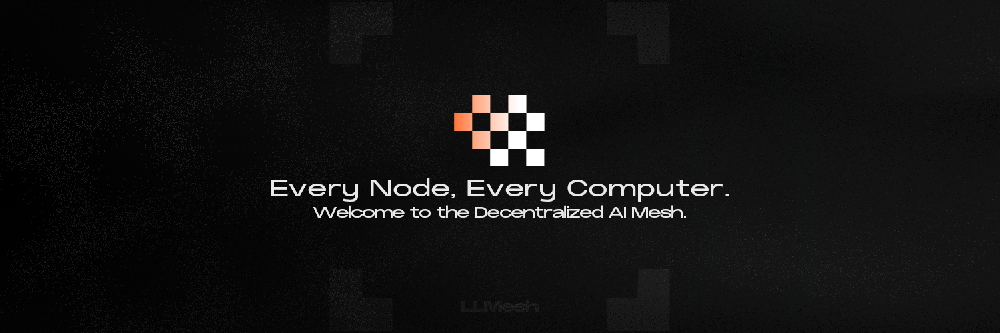

<div align="center">
  

  [](https://opensource.org/licenses/Apache-2.0)
  [](https://www.python.org/downloads/)
  [](https://x.com/LLMesh_io)
  [](https://llmesh.io)
  [](https://docs.llmesh.io)
  
  <br>
  
  [English](./README_en.md) | 中文
</div>

# LLMESH 网络

## 去中心化 LLM 和 AI 基础设施

LLMESH 是一个革命性的点对点网络，LLM 和 AI 模型可以在没有中央服务器的情况下直接连接。每个节点既充当模型主机又充当路由器，为 AI 的未来创建一个自愈、可扩展的基础设施。

**"无中心，全连接"**

### 核心特性

- **真正的 P2P 架构**：LLM 和 AI 模型无需中介即可直接通信
- **自愈网络**：节点离线时自动重新路由
- **动态负载均衡**：智能请求分布在整个网格中
- **激励参与**：$MESH 代币奖励网络贡献
- **隐私优先设计**：所有通信的端到端加密

### 网络统计

- **活跃节点**：1,247
- **LLM 模型**：89
- **总模型数**：312
- **平均响应时间**：47ms
- **网络正常运行时间**：99.97%

### 快速开始

```bash
# 安装 LLMESH
pip install llmesh-network

# 启动节点
llmesh-node start --stake 1000

# 部署您的 LLM
llmesh-deploy model.onnx --name "my-llm" --fee 0.1
```

### 文档

- [架构概览](docs/architecture.md)
- [API 参考](docs/api-reference.md)
- [白皮书](docs/whitepaper.md)

### $MESH 代币

$MESH 代币为网络经济提供动力：
- **质押**：保护网络并获得奖励
- **费用**：支付 LLM 推理和路由费用
- **治理**：对协议升级进行投票
- **激励**：通过提供计算资源赚取收益

### 投资者信息

LLMESH 代表着去中心化 AI 基础设施的未来，专注于 LLM 和基础模型。我们正在构建去中心化 AI 应用的支柱。

- **市场机会**：2030 年 LLM 市场规模超过 2000 亿美元
- **技术**：专利申请中的网格路由，优化 LLM 推理
- **团队**：前谷歌、OpenAI 和以太坊工程师
- **支持**：一线风投和战略合作伙伴

### 联系方式

- **网站**：[https://llmesh.io](https://llmesh.io)
- **X**：[@LLMesh_io](https://x.com/LLMesh_io)

---

<div align="center">
  由 LLMESH 社区用 ❤️ 构建
</div>